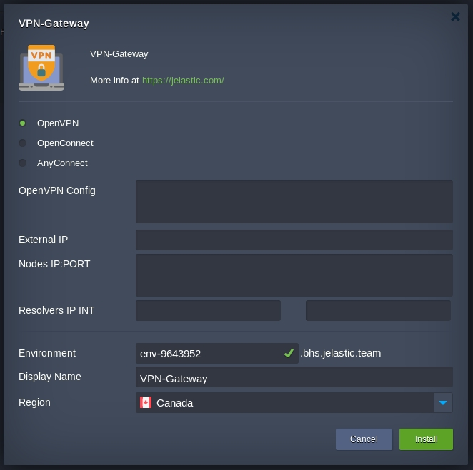

# Project VPN-Gateway

JPS to automation deploy VPN gateway to customers

## Installing

Copy and deploy.



1. Choose VPN Technology:
  - OpenVPN
  - OpenConnect
  - AnyConnect

2. Fill the fields
#### OpenVPN fields
*OpenVPN Config* - put in this field full OpenVPN client configuration with certificates, etc.

#### OpenConnect fields
*VPN Server Name / IP* - put in field FQDN or IP address  
*VPN Login / Password* - put values in separate fields for login and password  

#### AnyConnect fields
*VPN Server Name / IP* - put in field FQDN or IP address  
*GROUP Login / Pass* -  
*USER Login / Pass* -  

#### Common fields
*External IP* - put external IP for VPN-Gateway container  
*Nodes IP:PORT* - put in one per line list hard node IP, SSH port separate by ":"  
*Resolvers IP INT* - put in fireld internal IP from resolvers  

3. Add public IP to container and start service. Resolve any issue. (ex. add server SHA-256 sum to OpenConnect configuration)
```
CTID=
PUBLIC_IP=
PRIVATE_IP=
vzctl set $CTID --ipdel all --save
vzctl set $CTID --ipadd $PUBLIC_IP --save
vzctl set $CTID --ipadd $PRIVATE_IP --save
vzctl exec $CTID systemctl start  vpn@client
vzctl exec $CTID systemctl status  vpn@client
```


## License

This project is licensed under the MIT License - see the [LICENSE.md](LICENSE.md) file for details

## Acknowledgments

* Hat tip to anyone whose code was used
* 2